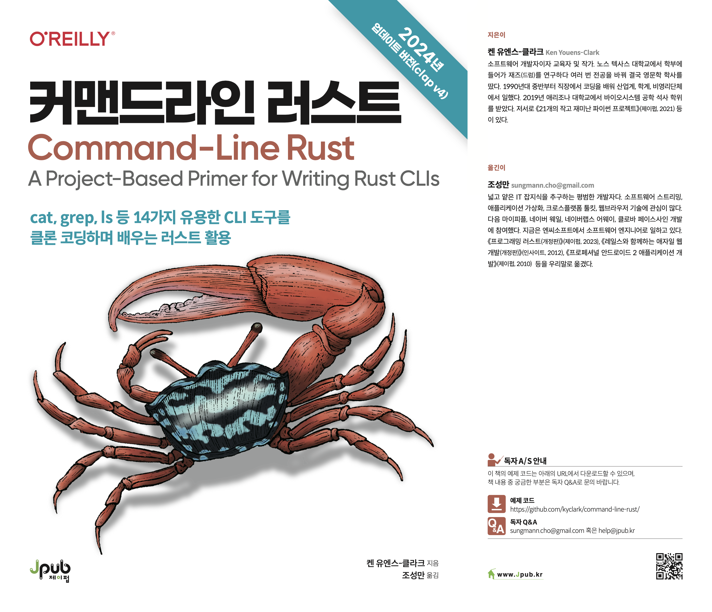
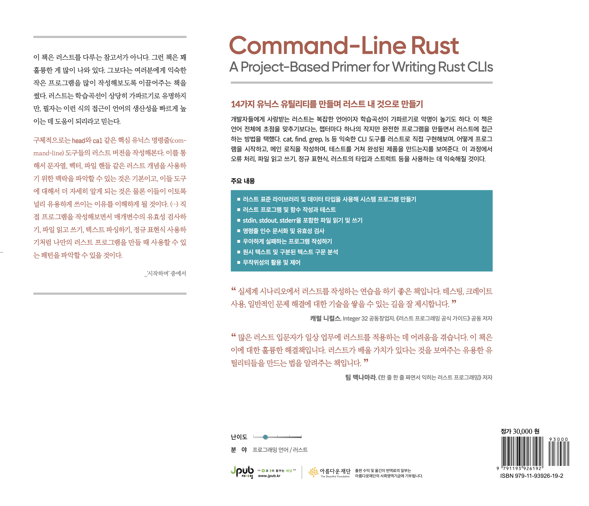

# 커맨드라인 러스트: cat, grep, ls 등 14가지 유용한 CLI 도구를 클론 코딩하며 배우는 러스트 활용

  
  

[교보문고](https://product.kyobobook.co.kr/detail/S000213800078) | 
[알라딘](https://www.aladin.co.kr/shop/wproduct.aspx?ItemId=342934165) | 
[예스24](https://www.yes24.com/Product/Goods/128929260)

## 책 소개

> "실세계 시나리오에서 러스트를 작성하는 연습을 하기 좋은 책입니다. 테스팅, 크레이트 사용, 일반적인 문제 해결에 대한 기술을 쌓을 수 있는 길을 잘 제시합니다."
>
> —캐럴 니컬스, Integer 32 공동창업자, 《러스트 프로그래밍 공식 가이드》 공동 저자

> "많은 러스트 입문자가 일상 업무에 러스트를 적용하는 데 어려움을 겪습니다. 이 책은 이에 대한 훌륭한 해결책입니다. 러스트가 배울 가치가 있다는 것을 보여주는 유용한 유틸리티들을 만드는 법을 알려주는 책입니다."
>
> —팀 맥나마라, 《한 줄 한 줄 짜면서 익히는 러스트 프로그래밍》 저자

14가지 유닉스 유틸리티를 만들며 러스트 내 것으로 만들기

개발자들에게 사랑받는 러스트는 복잡한 언어이자 학습곡선이 가파르기로 악명이 높기도 하다. 이 책은 언어 전체에 초점을 맞추기보다는, 챕터마다 하나의 작지만 완전한 프로그램을 만들면서 러스트에 접근하는 방법을 택했다. cat, find, grep, ls 등 익숙한 CLI 도구를 러스트로 직접 구현해보며, 어떻게 프로그램을 시작하고, 메인 로직을 작성하며, 테스트를 거쳐 완성된 제품을 만드는지를 보여준다. 이 과정에서 오류 처리, 파일 읽고 쓰기, 정규 표현식, 러스트의 타입과 스트럭트 등을 사용하는 데 익숙해질 것이다.

주요 내용

* 러스트 표준 라이브러리 및 데이터 타입을 사용해 시스템 프로그램 만들기

* 러스트 프로그램 및 함수 작성과 테스트

* stdin, stdout, stderr을 포함한 파일 읽기 및 쓰기

* 명령줄 인수 문서화 및 유효성 검사

* 우아하게 실패하는 프로그램 작성하기

* 원시 텍스트 및 구분된 텍스트 구문 분석

* 무작위성의 활용 및 제어

### 지은이 · 옮긴이 소개

<b>[켄 유엔스-클라크Ken Youens-Clark](https://twitter.com/kycl4rk)</b> 소프트웨어 개발자이자 교육자 및 작가. 노스 텍사스 대학교에서 학부에 들어가 재즈(드럼)를 연구하다 여러 번 전공을 바꿔 결국 영문학 학사를 땄다. 1990년대 중반부터 직장에서 코딩을 배워 산업계, 학계, 비영리단체에서 일했다. 2019년 애리조나 대학교에서 바이오시스템 공학 석사 학위를 받았다. 저서로 《21개의 작고 재미난 파이썬 프로젝트》(제이펍, 2021) 등이 있다.

<b>[조성만](https://twitter.com/chosungmann)</b> 넓고 얕은 IT 잡지식을 추구하는 평범한 개발자다. 소프트웨어 스트리밍, 애플리케이션 가상화, 크로스플랫폼 툴킷, 웹브라우저 기술에 관심이 많다. 다음 마이피플, 네이버 웨일, 네이버랩스 어웨이, 클로바 페이스사인 개발에 참여했다. 지금은 엔씨소프트에서 소프트웨어 엔지니어로 일하고 있다. 《프로그래밍 러스트(개정판)》(제이펍, 2023), 《레일스와 함께하는 애자일 웹 개발(개정판)》(인사이트, 2012), 《프로페셔널 안드로이드 2 애플리케이션 개발》(제이펍, 2010) 등을 우리말로 옮겼다.
